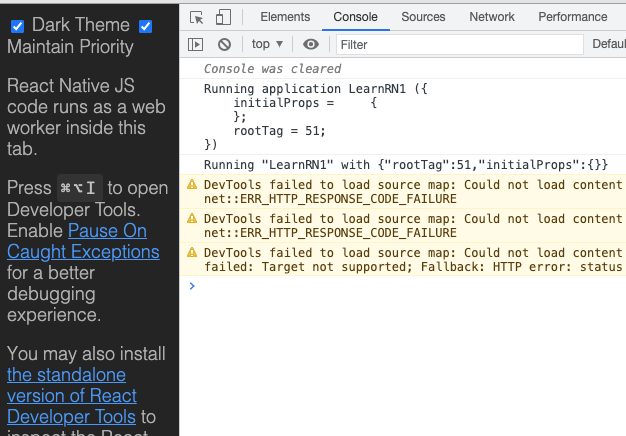

# 1、模拟器调试  

## 1.1、Mac环境  

在mac环境下按电脑的“command+D”即可弹出调试菜单。  

各按钮含义如下

* Reload: 重新加载，使用了watchman工具后，可以自动加载，即修改了代码后立即会看到展示效果
* Debug with Chrome: 使用chrome作为debugger工具

1. 要求安装了chrome的扩展程序：React Developer Tools
2. 点击该按钮，可以在chrome里显示debugger信息

* Show Inspector: 使示监视器，如下打开网络监示，即可显示网络操作

* Disable Fast Refresh: 关闭自动刷新。关闭后，修改了代码需要手动刷新才能展示修复后的内容
* Configure Bundler: 配置网络绑定
* Show Perf Monitor: 显示性能监控
