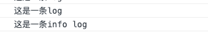
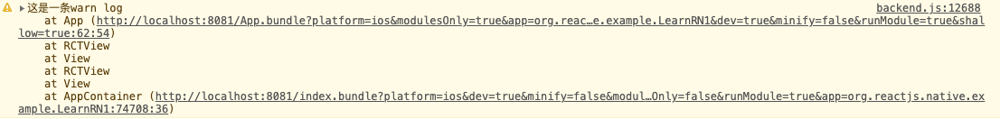

# 1、模拟器调试  

## 1.1、Mac环境模拟器调试入口  

在mac环境下按电脑的“command+D”即可弹出调试菜单。  


各按钮含义如下

* Reload: 重新加载，使用了watchman工具后，可以自动加载，即修改了代码后立即会看到展示效果
* Debug with Chrome: 使用chrome作为debugger工具

1. 要求安装了chrome的扩展程序：React Developer Tools
2. 点击该按钮，可以在chrome里显示debugger信息


* Show Inspector: 使示监视器，如下打开网络监示，即可显示网络操作


* Disable Fast Refresh: 关闭自动刷新。关闭后，修改了代码需要手动刷新才能展示修复后的内容
* Configure Bundler: 配置网络绑定
* Show Perf Monitor: 显示性能监控

## 1.2、日志调试

可以用console打印日志

```js
  console.log("这是一条log");
  console.info("这是一条info log");
  console.warn("这是一条warn log");
  console.error("这是一条error log");
```

对于info和log显示效果一样，如下


对于warn和error，在chrome中除了日志信息本身，还会有不同的颜色和日志堆栈  



同时对于warn和error，在模拟器上也有效果，如下  


但需要注意的是，日志太多对性能有影响，如果出现莫名其妙的红屏，则可以先排查一下是不是自己的console.log太多了。

## 1.3、断点调试

在chrome中打开sources，然后按ctrl + P ，输入文件名App.js


找到某一行代码点行号，然后重新加载代码(reload)，如下，就会到达断点处停止。有过编程经历同学想必已经知道如下使用断点，不再赘述。

